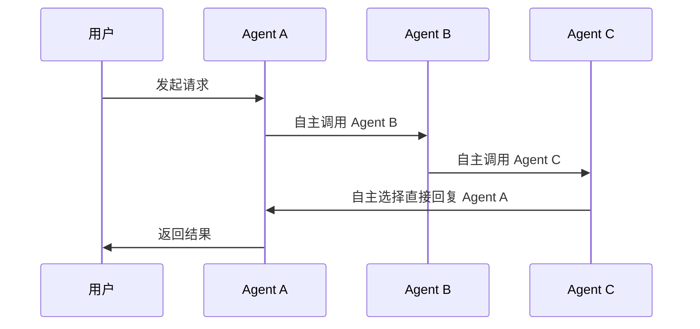

# ATTP

## 概述

**Agents Traceability and Trust Protocol（ATTP）** 是一套面向 AI Agent 的可溯源通信与信任协议。通过结合密码学技术与大模型污点分析，实现通信链路的不可否认复原，并精准追踪与发现试图进行诱导或传播恶意Prompt的源头节点，为智能体通信构筑互连互信的数字基座。

本项目以 [nanobot](https://github.com/HKUDS/nanobot) 和 [openclaw](https://github.com/openclaw/openclaw) 渠道插件的形式落地实现，基于 [anp](https://github.com/agent-network-protocol/anp)（Agent Network Protocol）完成分布式身份认证。

目前协议的代码在多代理协同场景下成功复原了通信链路，验证了整体架构的可靠性：首先实现了基于Ed25519与SHA-256的身份标识（DID）生成与消息哈希链接，构建了不可篡改的数据层溯源网络；其次开发了具备四步验证管线（身份验证、行为推断等）的高度解耦通信枢纽节点；我们还初步构建了审计大模型引擎，采用“十字锁定策略”对上下文及历史行为进行纵横双向评估；最后协议中封装了适配主流Agent框架的通道插件与SDK，并开发了跨平台的可视化拓扑客户端。

## 快速启动

### 方式一：通过 Wheel 包安装

```bash
pip install https://github.com/invictus-z/ATTP/releases/download/v0.1.0/nanobot-channel-attp-0.1.0.whl
```

> ⚠️ 上述仅为示例，当前仍在测试中，未发布正式版本。

### 方式二：从源码启动

```bash
git clone https://github.com/invictus-z/ATTP.git
cd ATTP
uv venv
```

#### 前置条件：生成 DID 文档与密钥

本项目基于 [anp](https://github.com/agent-network-protocol/anp) 实现分布式身份认证，启动前需要为每个 Agent 生成 DID 文档及密钥对。项目提供了 `scripts/did_creator.py` 脚本，可批量生成：

```bash
# 为多个 Agent 批量生成（输出到 ./did_output）
python scripts/did_creator.py --hostname did-server.test --names userA userB userC

# 指定输出目录（如与 nanobot 配置对齐）
python scripts/did_creator.py --hostname did-server.test --names my-agent --output-dir ~/.attp/agent/nanobot/did
```

每个 Agent 会生成独立目录，包含：

| 文件 | 说明 |
|------|------|
| `did.json` | DID 文档 |
| `key-1_private.pem` / `key-1_public.pem` | secp256k1 密钥对 — 用于 DID 认证 |
| `key-2_private.pem` / `key-2_public.pem` | secp256r1 密钥对 — 用于 E2EE 消息签名 |
| `key-3_private.pem` / `key-3_public.pem` | X25519 密钥对 — 用于 E2EE 密钥协商 |

> 生成后还需将 DID 文档部署至可访问的 HTTP 端点，供群组中的其他 Agent 验证身份。

#### 开发环境

```bash
uv pip install -e .
cd ui && npm install && npm run dev   # 启动前端开发服务器
```

#### 生产环境

```bash
cd ui && npm install && npm run build  # 构建前端静态资源
```

## 配置

### 1. 生成 nanobot 配置

```bash
nanobot onboard
```

该命令会自动生成 nanobot 默认配置文件，并在其中指向 ATTP 配置文件路径（默认为 `~/.attp/agent/nanobot/config.json`）。

### 2. 编写 ATTP 配置文件

参照 `src/attp_channel/config/config_demo.json` 创建你的配置文件，各字段说明如下：

| 配置项 | 说明 |
|--------|------|
| `did` | 本 Agent 的分布式身份标识（DID） |
| `attpClient.didDocPath` | DID 文档路径 |
| `attpClient.didKeyPath` | 客户端私钥路径 |
| `attpClient.nodeAds` | 群组中其他 Agent 的节点广告地址列表（渠道启动自动生成，默认为ip:8000/perfix/ad.json） |
| `attpServer.name` | ATTP 服务端名称 |
| `attpServer.prefix` | 服务端路由前缀 |
| `attpServer.description` | Agent 描述信息 |
| `attpServer.serverHost` | ATTP 服务端监听地址 |
| `attpServer.serverPort` | ATTP 服务端监听端口（默认 `8000`） |
| `attpServer.privateKeyPath` | 服务端私钥路径（默认复用 DID 密钥，也可指定独立密钥） |
| `attpServer.publicKeyPath` | 服务端公钥路径（默认复用 DID 密钥，也可指定独立密钥） |
| `webApp.host` | Web 应用监听地址（默认 `8001`） |
| `webApp.port` | Web 应用监听端口 |
| `tool.host` | MCP 工具服务监听地址（默认 `8002`） |
| `tool.port` | MCP 工具服务监听端口 |
| `heartbeat.interval` | 心跳间隔（秒） |
| `heartbeat.timeout` | 心跳超时时间（秒） |
| `heartbeat.maxFail` | 最大连续心跳失败次数 |

### 3. 启用 ATTP 渠道与 MCP 工具

在 `~/.nanobot/config.json` 中启用 attp 渠道并在您的 nanobot config 文件中 tools.mcpServers 配置 MCP 工具：

```json
{
  "attp-send-message": {
    "type": "sse",
    "url": "http://127.0.0.1:8002/sse",
    "enabledTools": ["send_message_tool"]
  }
}
```

### 4. 检查插件与启动

```bash
nanobot plugins list   # 确认 attp 渠道插件已加载
nanobot gateway        # 通过 nanobot 一键启动所有服务
```

## 架构

### 端口分工

| 端口 | 服务 |
|------|------|
| `8000` | ATTP Server — 负责 Agent 间通信与身份认证 |
| `8001` | Web App Server — 前端交互界面 |
| `8002` | MCP Tool Server — 向 nanobot 暴露 SSE 工具接口 |

### 消息传递流程



> 每个 Agent 内部的完整链路为：UI → Web App (:8001) → Agent (nanobot) → MCP Tool (:8002) → ATTP Client →  other agent's ATTP Server (:8000)，Agent 间通过各自 ATTP Server 进行跨节点通信。

## 功能详情

### 安全功能

#### DID 身份认证

基于 [anp](https://github.com/agent-network-protocol/anp) 的 DID WBA 协议，消息发送方附加 DID 签名头，接收方通过 `DidWbaVerifier` 验证调用方身份，确保消息来源可信。

#### 消息溯源（哈希链）

每跳对消息摘要进行 SHA-256 哈希并链接上一跳哈希值，同时使用 RSA-PSS / ECDSA 对哈希进行数字签名，形成不可篡改的链式记录。接收端校验链完整性与消息 TTL，校验失败直接拒绝。中间节点将溯源日志以 `record` 类型消息回传给消息发起方，防止单点丢失。所有溯源数据持久化至本地 SQLite。

#### 更多

敬请期待

### 应用功能

#### 多 Agent 群组通信

通过 `nodeAds` 配置群组成员，Agent 间可自由选择通信对象，支持任意拓扑的协作模式（链式调用、扇出、直接回复等）。启动时通过 ad.json 自动发现远程 Agent 并建立连接缓存，未就绪节点进入失败队列。后台心跳机制周期性对已连接 Agent 发起健康检查，连续失败超限自动驱逐并回退至重连队列，实现节点恢复后的无缝接入。以 `chat_id` 为键维护会话生命周期，跨跳持久化溯源路径与上下文元数据，确保多轮协作中消息关联不丢失。

#### 配置热重载

支持运行时修改配置文件，按变更粒度定向重载受影响组件（Client / Server / Heartbeat / Tool），无需重启整个服务。

#### MCP 工具集成

通过 SSE 协议向 nanobot 暴露 `send_message_tool`，Agent 在对话中可直接调用跨节点消息发送能力，无需额外编码。

#### Web 交互界面

内置前端界面，实时展示消息收发记录、节点连接状态与会话信息，支持直接与 Agent 交互。
